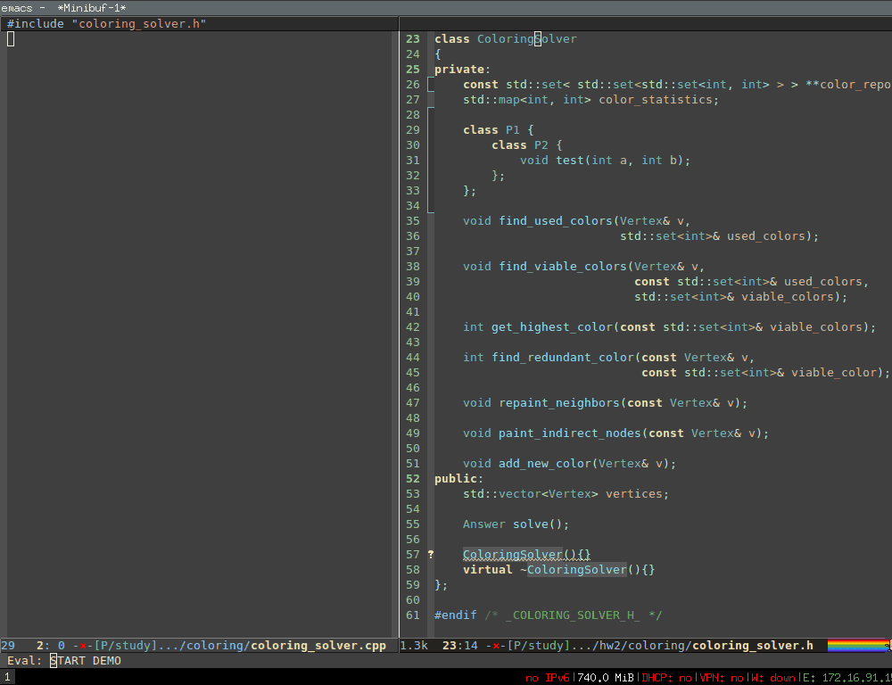
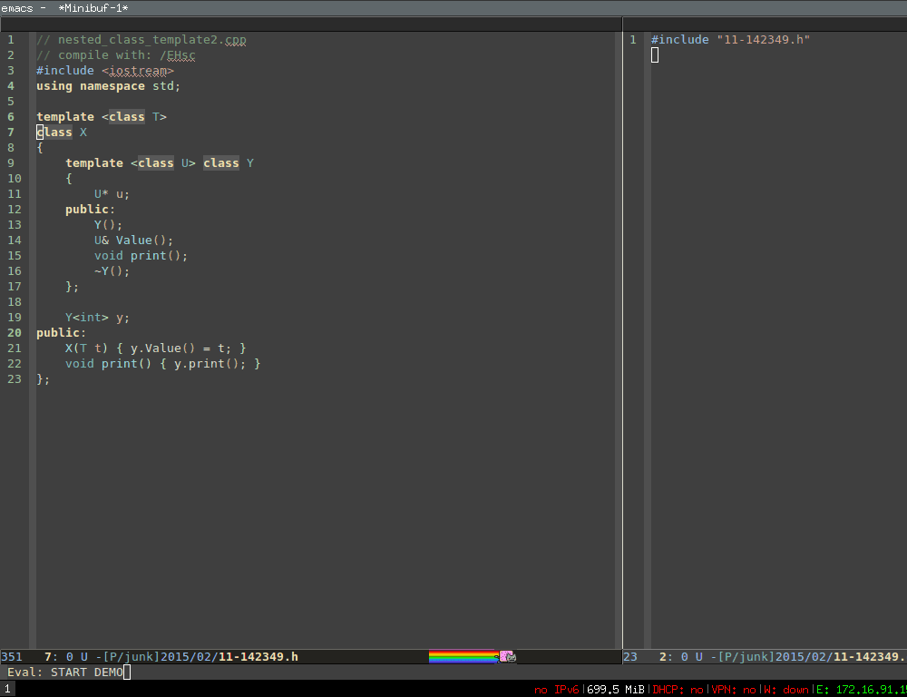
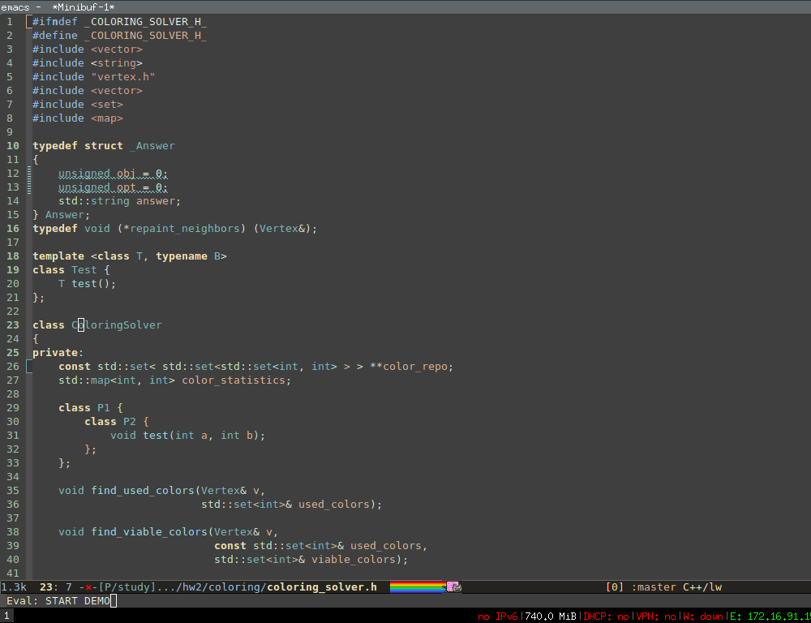
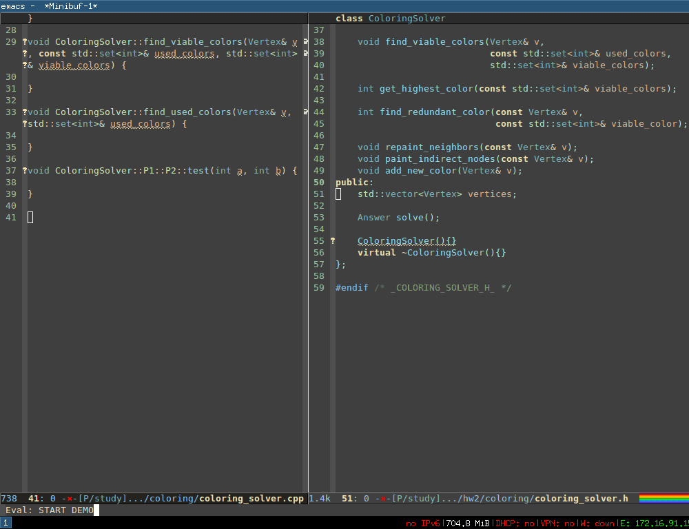
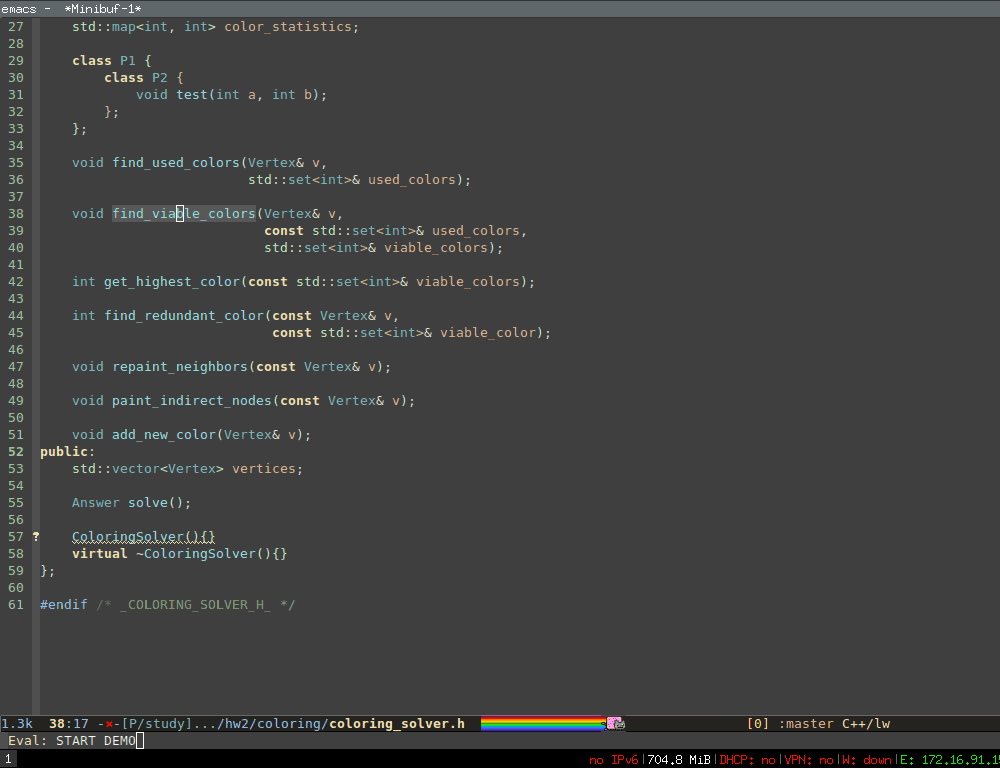
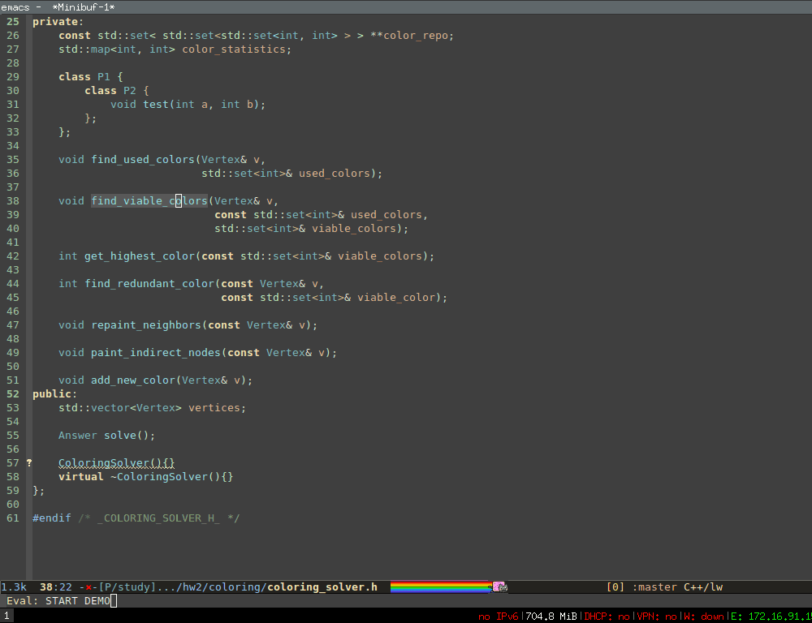
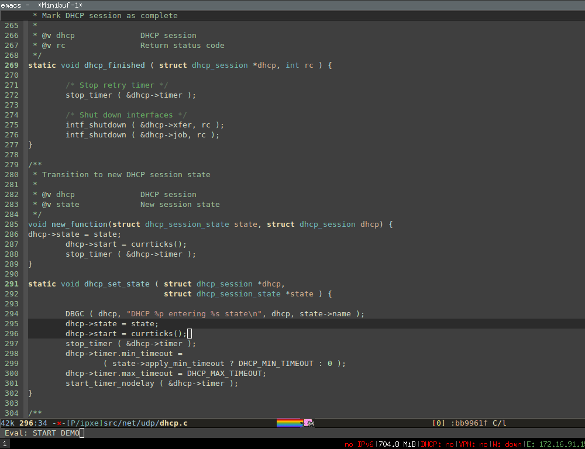
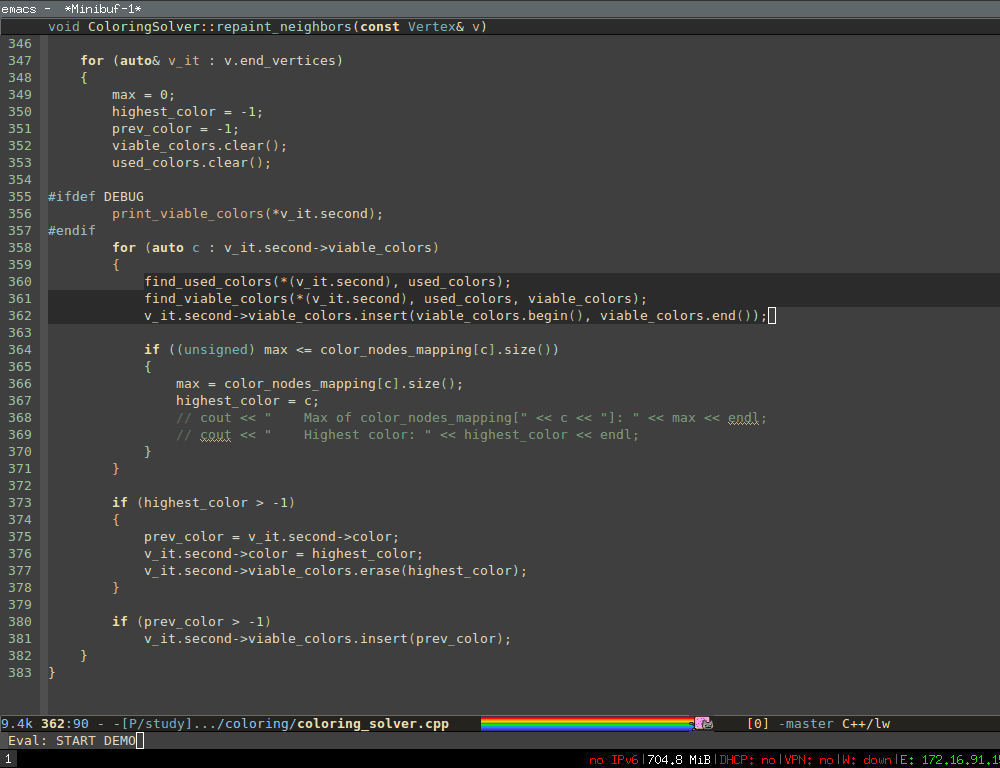

<h2>Table of Contents</h2>

<ul>
<li><a href="#sec-1">1. Context-sensitive menu:</a></li>
<li><a href="#sec-2">2. Generate class and function implementation</a></li>
<li><a href="#sec-3">3. Generate class getters and setters</a></li>
<li><a href="#sec-4">4. Generate function prototype</a></li>
<li><a href="#sec-5">5. Convert function to function pointer</a></li>
<li><a href="#sec-6">6. Convert function to function parameter</a></li>
<li><a href="#sec-7">7. Move semantic units</a></li>
<li><a href="#sec-8">8. Extract function</a></li>
<li><a href="#sec-9">9. Current limitation</a></li>
</ul>

# Context-sensitive menu:

When user runs the command, a menu appears and offer refactoring
choices based on current scope of semantic tag. For example, if the
cursor is inside a class, the menu lists choices such as generate
function implementations for the class, generate class
getters/setters&#x2026; Each menu item also includes its own set of
options, such as perform a refactoring option in current file or other
file.

# Generate class and function implementation

From the header file, all function prototypes of a class can be
generated into corresponding empty function implementation in a source
file. The generated function implementations also include all of their
(nested) parents as prefix in the names, if any. If the class is a
template, then the generated functions also includes all templates
declarations and in the parent prefix properly.

Since all function implementations can be generated a class, this
feature should be present.

Demonstration 1 (with nested classes):

Demonstration 2 (with nested classes and templates):

Note that in the demos, you see some regions highlighted with red
colors. Those regions are spaces inserted by Semantic Refactor, so
when you move the cursor inside a generated function body, you can
start typing code immediately without indenting.

# Generate class getters and setters

All getters and setters of all variables in a class can be
automatically generated with appropriate type information. Obviously,
generating individual getter and setter for each variable works as
well.

Demonstration:

# Generate function prototype

When the cursor is in a function implementation, a function prototype
can be generated and placed in a selected file. When the prototype is
moved into, its prefix is stripped.

Demonstration:

# Convert function to function pointer

Any function can be converted to a function pointer with typedef. 

Demonstration:

# Convert function to function parameter

The converted function pointer can also be placed as a parameter of a
function. In this case, all the parameter names of the function
pointer is stripped.

Demonstration:

# Move semantic units

Any meaningful tags recognized by Semantic (class, function, variable,
namespace&#x2026;) can be moved relative to other tags in current file or
any other file.

Demonstration:

# Extract function

Select a region and turn it into a function, with relevant variables
turned into function parameters and preserve full type information.
Notice that after the region is replaced with a function call, in the
minibuffer (at the bottom), Semantic shows the interface of newly
function immediately if `global-semantic-idle-summary-mode` is enabled.

Demonstration (C mode):

Demonstration (C++ mode):

# Current limitation

In the C++ demo, the extracted function does not include namespace
prefix for its parameters. This is because currently Semantic Refactor
can only operate with Semantic tags in current buffer. Things starts
getting much more complicated outside of current file. For example,
the namespace information of `map` is not in `map` header file that we
include, but in `bits/stl_map.h`. To search for such information
requires Semantic to perform exhaustive search for all the included
files, which would take a long time and block Emacs.

One solution to this problem is to use a fast external indexer like
GNU Global along with Semantic. GNU Global can generate tag database
fast, but lack necessary information for smart refactoring; Semantic
is smart but is slow. We can combine them to make the best of both:
Global collects tag positions and Semantic decides which tag position
is valid and how to refactor with valid tags. 

This is just a plan.
